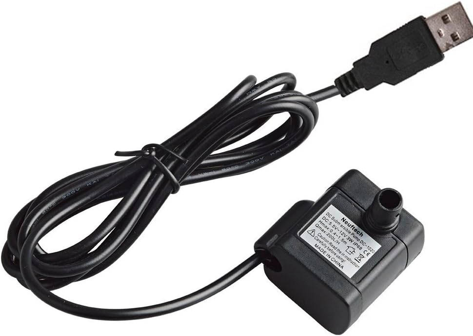

# Bomba de riego para plantas de interior

La idea es meter la bomba en un deposito de unos 20 litros de agua y sobre ella
montar un arduino que lo controle.  Todo el circuito funciona a 9v, tanto la
electrónica como la bomba. He calculado los consumos para instalar en el futuro
una batería. Ahora mismo se conecta a la corriente doméstica usando un
transformador. Los consumos medidos a 9v son:

* **Arduino activo y sin carga**: 12 mA
* **Arduino activo activando el MOSFET**: 18 mA
* **Arduino dormido**: 3 mA
* **Bomba de agua a 9v**:  400mA

Así que más o menos cumple la especificación que indica que la potencia es de 1
a 3 Watt (9v x 0.4 Amp = 3.6 Watt). El caudal de agua calculado en diferentes
pruebas ha sido de:

* 40 ml por segundo
* 0,20 litros en 5 segundos

Por ahora, a falta de regulador externo el funcionamiento lo controlo
internamente usando las variables:

* `WORKING_TIME`: Indica el tiempo de funcionamiento de la bomba
* `WORKING_PERIOD`: Indica el tiempo de reposo de la bomba

Se instalan además un led de control que parpadea para saber que el sistema está
funcionando correctamente y un interruptor de control de corriente.

## Enlaces:
- [Arduino y bomba de agua](https://www.luisllamas.es/bomba-de-agua-con-arduino/)
- [Arduino en modo sueño](https://www.prometec.net/el-modo-sleep-en-arduino/)

